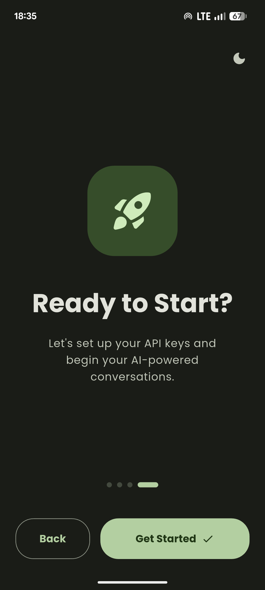
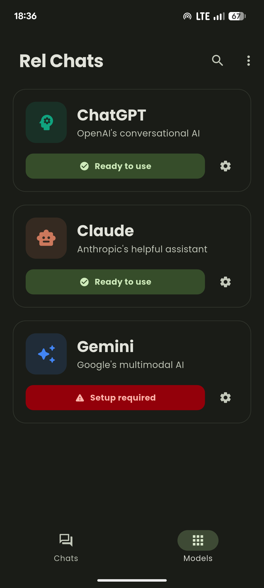
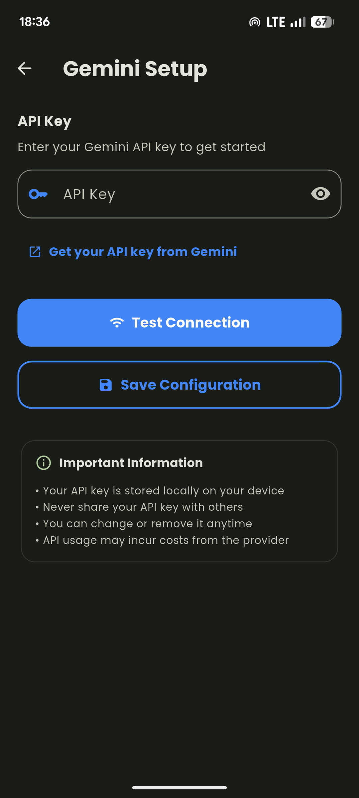

# Rel Chats – Multi-AI Flutter Chat App

A modern Flutter chat application that allows users to connect with multiple AI models — including ChatGPT, Claude, and Gemini — using their own API keys.
Rel Chats emphasizes privacy, personalization, and dynamic theming powered by Material You.

## Screenshots

  
  
  

## Contributing

1. Fork the project
2. Create your feature branch
3. Follow the established file structure
4. Add proper documentation
5. Submit a pull request
